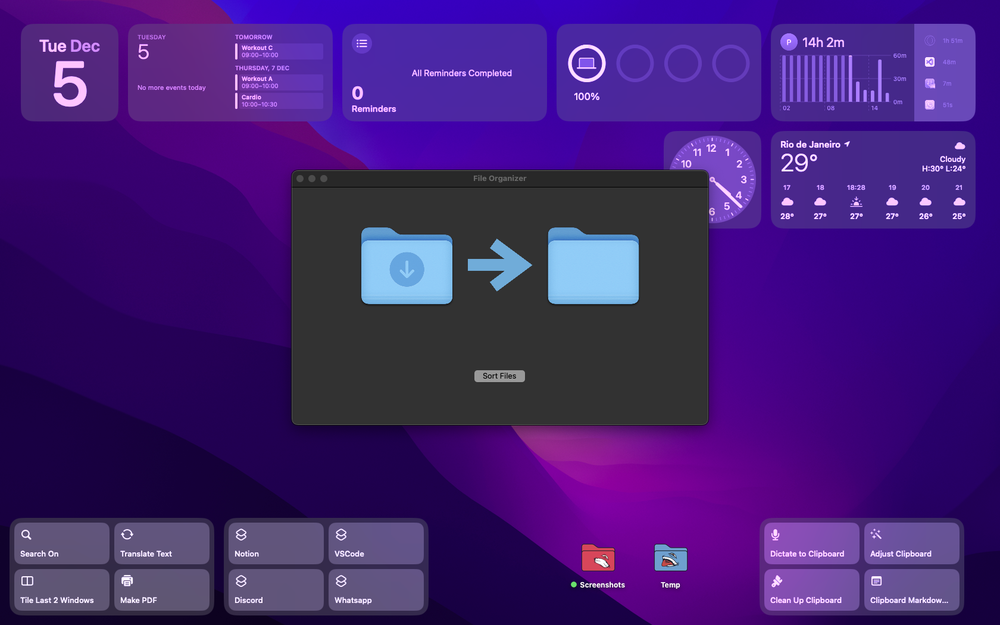
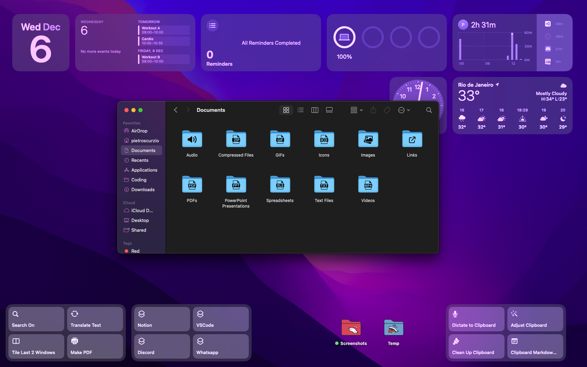

# File Organizer App

## Overview

The File Organizer App is a simple Python application that helps you organize files in your Downloads folder by categorizing them into specific folders within your iCloud Drive/Documents directory.

## Features

- Automatically organizes files based on their types into predefined folders.
- Predefined folders with unique icons.
- Provides a graphical user interface (GUI) for easy file organization.
- Supports various file types, including documents, PDFs, images, audio files, videos, and more.

## Installation

1. Download the latest version of the application from [here](https://github.com/PietroScurzio/FileOrganizer/blob/main/FileOrganizer.dmg).
2. Open the downloaded DMG file (`FileOrganizer.dmg`).
3. Drag the application (`FileOrganizer.app`) to your Applications folder.

Now, you can run the application from your Applications folder.

## Supported File Types

- **Documents:** .doc, .docx, .csv, .txt, .RTF
- **PDFs:** .pdf
- **Spreadsheets:** .xlsx, .xls
- **PowerPoint Presentations:** .ppt, .pptx
- **Compressed Files:** .zip, .rar
- **Images:** .png, .jpg, .jpeg
- **Audio:** .m4a, .mp3, .wav
- **Videos:** .mp4, .avi, .mov
- **GIFs:** .gif
- **Icons:** .ico, .icns
- **Links:** .html, .htm

## Screenshots

## System Requirements

- macOS operating system
- Sufficient disk space in iCloud Drive/Documents

## Support and Issues

If you encounter any issues or have questions, please feel free to send a message.

## Credits

- Developed by Pietro Scurzio
- Icons from [www.flaticon.com]

---
